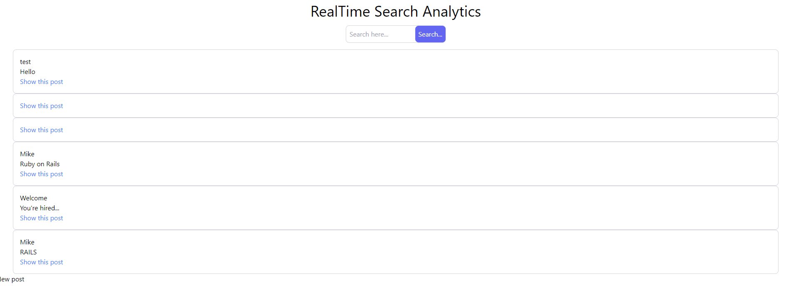

# HelpJuice Search-Analytics challenge project 

this project was part of a challenge from HelpJuice Company.
The features of the project is to build a search application for Articles where you can see the search trends from other users.

# Features

## Realtime validation

When you start typing for a search the first filter for the search works in real time without clicking the "Create Search" button. The validation work according to the validation of the Search Model.

## Displaying all the Searches

The searches are displayed on the root page. The second filter works with the elasticsearch database. Taking the questions or sentences filter by the complete questions method in the searchable.rb file coming from the elasticsearch Model methods.

## Images

## Built and tested With

- ruby "3.2.2"
- gem "rails", "~> 7.0.4"
- Rspec
- Postgres: >=16.0

## Live demo link

Visit the live demo [link]()

## Setup

Download the repo with this command

`https://github.com/MICHAELKITH/realtime.git`

`cd realtime`

Install the Gems and Dependencies

`bundle install`

Migrate the database and models

`rails db:create`
`rails db:migrate`
`rails db:seed`

## For the usage

Run the server

`rails server`

Open in the browser `http://localhost:3000/`

## Run the test 

Run this command

`bundle exec rspec`

## 👥 Author 

👤 **Michael Kithinji**

- GitHub: [@githubhandle](https://github.com/MICHAELKITH)
- Twitter: [@twitterhandle](https://twitter.com/DevMichael11)
- LinkedIn: [LinkedIn](https://www.linkedin.com/in/michaelkithinji/)

## 🤝 Contributing

Contributions, issues and feature requests are welcome!

Feel free to check the [issues page](https://github.com/MICHAELKITH/realtime/issues).

## Show your support

Give a ⭐️ if you like this project!

## Acknowledgments

- Project inspired and challenged by HelpJuice.

## 📝 License

This project is [MIT](https://opensource.org/licenses/MIT) licensed.

